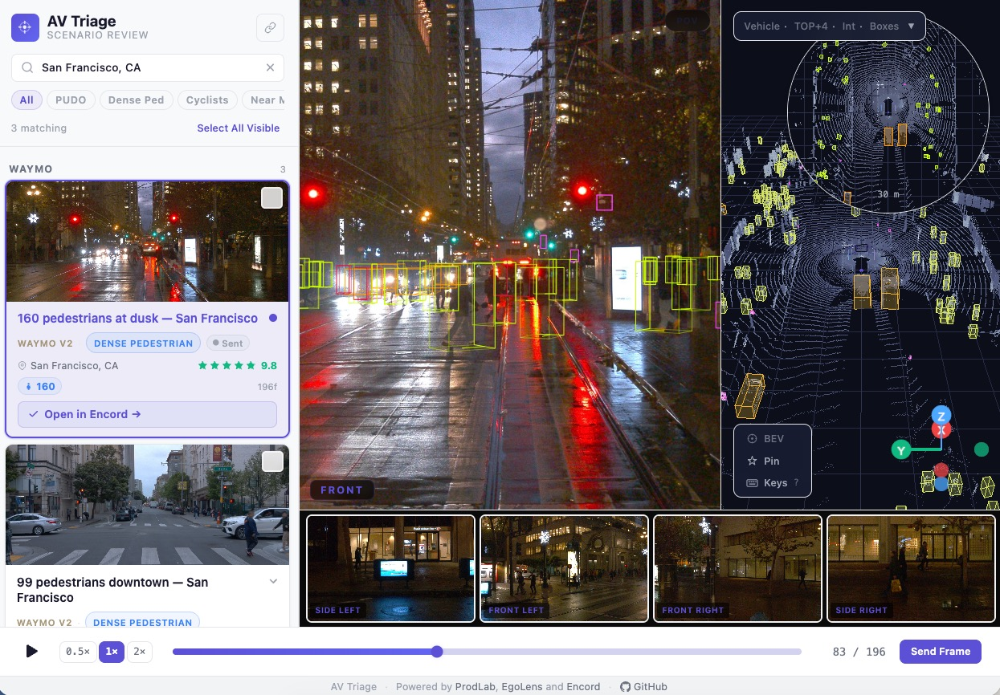
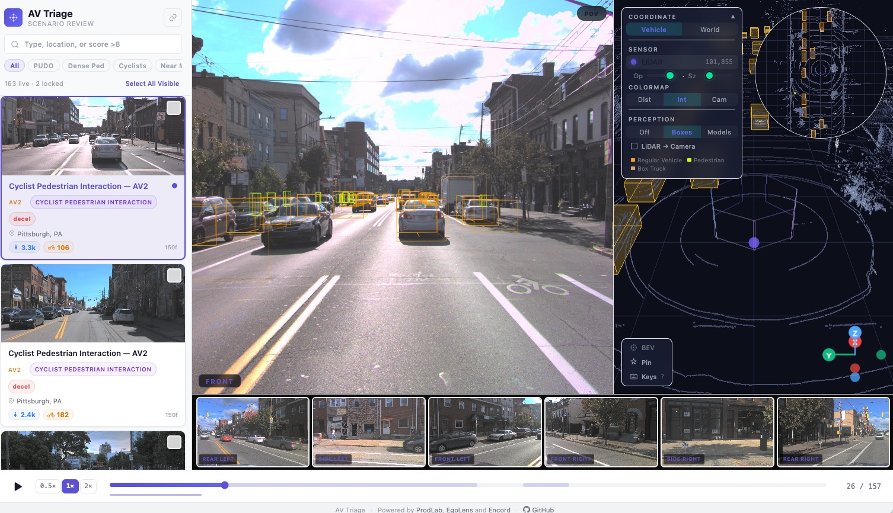
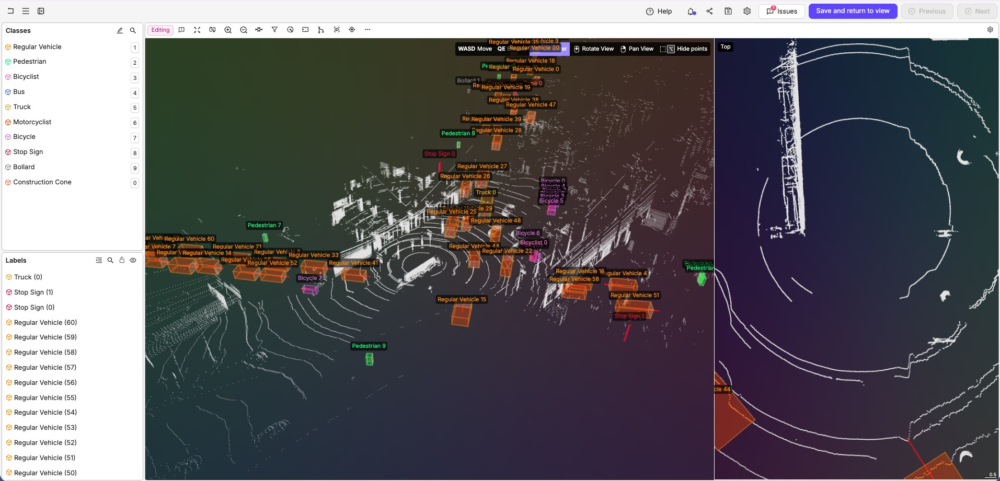
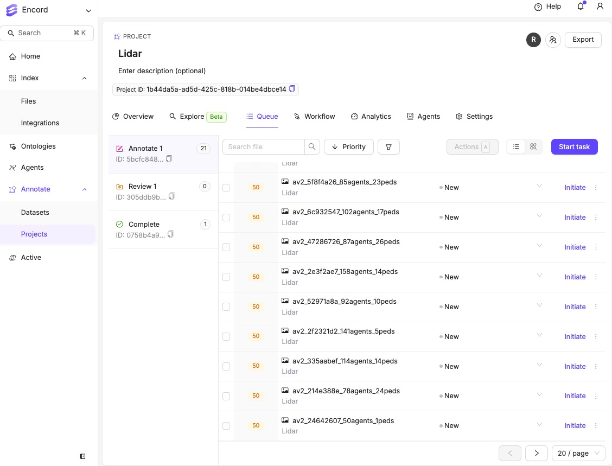

# AV Triage

**Find the right scenarios to label.** Built on [EgoLens](https://github.com/egolens/egolens) 3D perception engine. Browse 150+ scored autonomous vehicle scenarios, preview in 3D LiDAR, and send to [Encord](https://encord.com) for labeling — with pre-drawn 3D cuboid predictions.

Built for AV teams that need to prioritize which driving scenarios to annotate first.



## What It Does

- **Browse** — Search and filter 169 AV scenarios by safety type (near miss, dense pedestrian, cyclist interaction, PUDO, mid-block crossing), city (Pittsburgh, Boston, SF, Singapore), or quality score
- **Preview in 3D** — Click any scenario to load the full LiDAR point cloud with 5 camera views, 3D bounding boxes, trajectory trails, and playback controls
- **Send to Encord** — Batch select scenarios and send to Encord with one click. Waymo scenes arrive with 150–185 pre-drawn 3D cuboid predictions ready for labeler review
- **Track progress** — Live workflow status synced from Encord (Queued → Annotating → Review → Complete)

## Screenshots

### AV2 3D LiDAR Viewer — Pittsburgh


### Waymo V2 3D Viewer — San Francisco


### Encord 3D Label Editor — Cuboid Predictions


### Encord Project Queue


## Supported Datasets

| Dataset | Scenarios | 3D Viewer | Send to Encord |
|---------|-----------|-----------|----------------|
| Argoverse 2 | 166 (val split) | ✅ LiDAR + 7 cameras | ✅ Front camera image |
| Waymo V2 | 3 (SF, val split) | ✅ LiDAR + 5 cameras | ✅ 3D point cloud + cuboid predictions |

## Quick Start

### Prerequisites

- Node.js 18+
- Python 3.11
- [Encord](https://encord.com) account with SSH key
- Google Cloud SDK (`gcloud`) for Waymo send flow

### Install

```bash
git clone https://github.com/your-repo/av-triage.git
cd av-triage
npm install
pip3.11 install -r requirements.txt
```

### Configure

```bash
# Encord SSH key (required)
mkdir -p ~/.encord
cp your-encord-key.ed25519 ~/.encord/encord-av-triage-private-key.ed25519

# GCS auth (required for Waymo → Encord send)
gcloud auth login
gcloud auth application-default login
gcloud auth application-default set-quota-project waymo-491100
```

### Run

```bash
# Terminal 1 — Frontend
npm run dev

# Terminal 2 — API server
python3.11 -m uvicorn api.server:app --port 8001 --reload
```

Open [http://localhost:5173](http://localhost:5173)

## Architecture

```
┌─────────────────────────────────────────────────┐
│  Browser (localhost:5173)                        │
│  ┌───────────┐  ┌──────────┐  ┌──────────────┐  │
│  │ Dashboard  │  │ Sidebar  │  │ 3D LiDAR     │  │
│  │ 6 use case │  │ 169 cards│  │ Viewer       │  │
│  │ cards      │  │ batch    │  │ + 5 cameras  │  │
│  │ city chips │  │ select   │  │ + bounding   │  │
│  │ progress   │  │ send     │  │   boxes      │  │
│  └───────────┘  └──────────┘  └──────────────┘  │
└──────────────────────┬──────────────────────────┘
                       │ POST /api/encord/send
                       │ GET  /api/encord/status
                       ▼
┌─────────────────────────────────────────────────┐
│  API Server (localhost:8001)                     │
│  FastAPI + Encord SDK                            │
│                                                  │
│  AV2 flow:  S3 → best frame → JPEG → Encord     │
│  Waymo flow: GCS → range image → PLY → GCS →    │
│              Encord scene + cuboid predictions    │
└──────────────────────┬──────────────────────────┘
                       │
          ┌────────────┼────────────┐
          ▼            ▼            ▼
   ┌──────────┐  ┌──────────┐  ┌──────────┐
   │ Argoverse│  │ GCS      │  │ Encord   │
   │ S3       │  │ Bucket   │  │ Platform │
   │ (public) │  │ (public) │  │ (SDK)    │
   └──────────┘  └──────────┘  └──────────┘
```

## Project Structure

```
av-triage/
├── api/
│   └── server.py              # FastAPI backend — Encord integration
├── src/
│   ├── App.tsx                # Main app, dashboard, landing page
│   ├── components/
│   │   ├── ScenarioPanel/     # Sidebar with scenario cards, batch send
│   │   ├── LidarViewer/       # Three.js 3D point cloud renderer
│   │   ├── CameraPanel/       # Multi-camera image display
│   │   └── Timeline/          # Playback controls
│   ├── adapters/
│   │   ├── waymo/             # Waymo V2 data loading
│   │   ├── argoverse2/        # AV2 data loading
│   │   └── nuscenes/          # nuScenes data loading
│   ├── stores/
│   │   ├── useSceneStore.ts   # 3D scene state + data loading
│   │   └── useFilterStore.ts  # Shared filter state
│   ├── utils/
│   │   └── rangeImage.ts      # Waymo range image → point cloud math
│   ├── data/
│   │   └── scenario_index.json # 169 scored scenarios
│   └── theme.ts               # Encord-style light theme
├── vite.config.ts
└── package.json
```

## Waymo 3D Pipeline

The Waymo send flow converts range images to a 3D point cloud with bounding box predictions:

```
lidar.parquet (170MB)          → Range image decode → PLY point cloud
lidar_calibration.parquet      → Extrinsic matrices    (50K points, ASCII)
                                                            │
                                                    Upload to GCS
                                                            │
                                                    Create Encord scene
                                                    (scene JSON + SDK)
                                                            │
lidar_box.parquet              → 3D bounding boxes → Write cuboid
                                 for target frame     predictions
                                                    (150-185 per scene)
```

**Range image → XYZ conversion:**
- Waymo LiDAR stores data as 2D grids (height × width × 4 channels: range, intensity, elongation, NLZ)
- Compute beam inclination and azimuth angles per pixel
- Convert spherical → cartesian: `x = range × cos(inc) × cos(az)`
- Apply 4×4 extrinsic matrix (sensor → vehicle frame)
- Merge all 5 sensors, downsample to 50K points

## Encord Integration

### Resources

| Resource | ID |
|----------|-----|
| Lidar project | `1b44da5a-ad5d-425c-818b-014be4dbce14` |
| Lidar dataset | `25abe913-d0eb-4134-be8d-29712a8354b0` |
| Storage folder | `e6b191f4-51bf-4409-bf41-1df05b07360e` |
| Lidar ontology | `1f51b0e3-86c1-4906-8494-a1b3abcae35c` |
| GCS bucket | `gs://rafael-encord-waymo/` |

### Ontology (10 cuboid classes)

Regular Vehicle · Pedestrian · Bicyclist · Bus · Truck · Motorcyclist · Bicycle · Stop Sign · Bollard · Construction Cone

### Scene JSON Format

```json
{
  "scenes": [{
    "title": "waymo_17791493_3d",
    "scene": {
      "lidar": {
        "type": "point_cloud",
        "events": [{"uri": "gs://rafael-encord-waymo/waymo_3d_scenes/waymo_17791493_3d.ply"}]
      }
    }
  }]
}
```

### Workflow Status Sync

The app polls `GET /api/encord/status` every 30 seconds to show live workflow badges:
- **Queued** — Task created, waiting for annotator
- **Annotating** — Labeler is working on it
- **In Review** — Submitted for review
- **Complete** — Approved

## Environment Variables

| Variable | Default | Description |
|----------|---------|-------------|
| `ENCORD_SSH_KEY` | `~/.encord/encord-av-triage-private-key.ed25519` | Path to Encord SSH key |
| `ENCORD_PROJECT_HASH` | `1b44da5a-...` | Encord Lidar project ID |
| `ENCORD_DATASET_HASH` | `25abe913-...` | Encord Lidar dataset ID |

## Data Sources

### Argoverse 2
- Public S3: `s3://argoverse/datasets/av2/sensor/val/`
- 166 scenarios with LiDAR (feather), cameras (JPEG), annotations (feather)
- Direct x/y/z point coordinates

### Waymo V2
- GCS: `gs://rafael-encord-waymo/waymo_v2/`
- 3 SF validation segments copied from `gs://waymo_open_dataset_v_2_0_1/`
- Components: lidar, vehicle_pose, lidar_calibration, lidar_box, lidar_pose, camera_calibration, camera_image, stats
- Range image format (requires conversion)

## Tech Stack

- **Frontend:** React + TypeScript + Vite + Three.js + Zustand
- **Backend:** Python + FastAPI + Encord SDK
- **3D:** Custom WebGL point cloud renderer with Web Workers for parallel parquet decompression
- **Data:** Apache Parquet (browser-side), Apache Arrow/Feather
- **Style:** Encord-inspired light theme, purple accents (#5B50D6)

## Credits

Powered by [ProdLab](https://prodlab.ai), [EgoLens](https://egolens.dev), and [Encord](https://encord.com)

## License

For research and demonstration purposes. Waymo Open Dataset subject to [Waymo terms](https://waymo.com/open/terms/). Argoverse 2 subject to [Argoverse terms](https://www.argoverse.org/about.html#terms-of-use).
