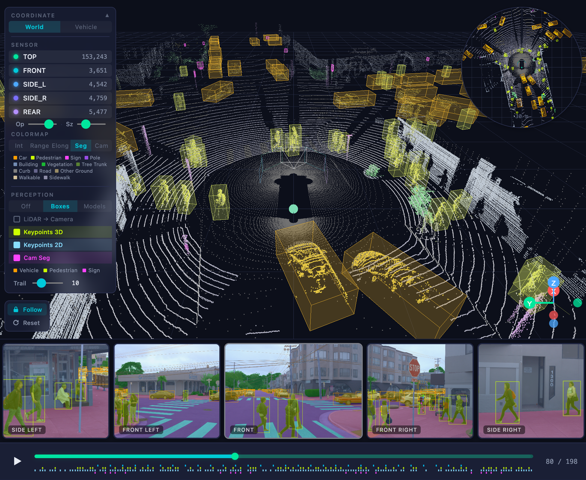

<h1 align="center">EgoLens</h1>

<p align="center">
  Visualize point clouds, cameras, and 3D annotations in your browser<br/>
  — straight from the most widely used autonomous driving datasets.<br/>
  No conversion, no preprocessing.
</p>

<p align="center">
  <a href="https://waymo.com/open/download/"></a>&nbsp;
  <a href="https://www.nuscenes.org/"></a>&nbsp;
  <a href="https://www.argoverse.org/"></a>
</p>

<p align="center">
  <a href="https://egolens.github.io/egolens"><strong>Live Demo</strong></a> ·
  <a href="#url-loading">URL Loading</a> ·
  <a href="#share-view">Share View</a> ·
  <a href="#dev-setup">Dev Setup</a>
</p>

<p align="center">
  
</p>

## What It Does

One tool for the three most widely used AV datasets. Drop a folder or paste a URL — auto-detected, zero setup.

- **LiDAR point clouds** with multiple colormap modes (intensity, height, range, segmentation, camera projection)
- **3D bounding boxes** as wireframes or 3D models with color-coded tracking
- **Synchronized camera views** with POV switching — click a camera to jump into its viewpoint
- **Trajectory trails** showing object movement over past frames
- **Semantic segmentation** overlays (LiDAR and camera)
- **Timeline** with play/pause, frame scrubber, and buffer progress bars

<table>
  <tr>
    <td></td>
    <td></td>
  </tr>
</table>

## Supported Datasets

| Feature | Waymo v2 | nuScenes | Argoverse 2 |
|---------|:--------:|:--------:|:-----------:|
| LiDAR point cloud | ✓ (5 sensors) | ✓ (1 sensor + 5 radar) | ✓ (2 sensors) |
| Camera images | ✓ (5 cams) | ✓ (6 cams) | ✓ (7 cams) |
| 3D bounding boxes | ✓ | ✓ | ✓ |
| 2D camera boxes | ✓ | — | — |
| Cross-modal hover linking | ✓ | — | — |
| Trajectory trails | ✓ | ✓ | ✓ |
| 3D human keypoints | ✓ | — | — |
| 2D camera keypoints | ✓ | — | — |
| LiDAR segmentation | ✓ (23-class) | ✓ (32-class) | — |
| Camera panoptic seg | ✓ (29-class) | — | — |
| POV camera switching | ✓ | ✓ | ✓ |
| Local (drag & drop) | ✓ | ✓ | ✓ |
| URL loading | ✓ | ✓ | ✓ |

Dataset format is auto-detected from folder structure.

## Quick Start

### Local files (drag & drop)

1. Open the [live demo](https://egolens.github.io/egolens)
2. Drag & drop your dataset folder into the browser
3. Done — browse frames, toggle sensors, play the timeline

### URL Loading

Load data directly from S3 or any static file server by providing a URL.

**Two modes:**

- **URL only** — auto-discovers all segments/scenes in the directory
- **URL + Segment ID** — loads a specific segment directly (works with any static file server)

```
https://egolens.github.io/egolens/?dataset=argoverse2&data=https://your-server.com/av2/sensor/val/
https://egolens.github.io/egolens/?dataset=nuscenes&data=https://your-server.com/nuscenes/
https://egolens.github.io/egolens/?dataset=waymo&data=https://your-server.com/waymo_data/&scene=SEGMENT_ID
```

The URL should point to a directory containing the dataset's standard folder structure. Works with S3 buckets, any HTTP server, or localhost.

> **Note:** Waymo's license prohibits data redistribution, so no hosted demo data is available. You'll need to host your own copy after accepting the [Waymo Open Dataset License](https://waymo.com/open/terms/).

### Share View

**Share what you see.** Click the Share View button and get a URL that captures your exact view — frame, colormap, camera angle, overlays, everything. Anyone with the same data can open the link and land on exactly what you were looking at.

## Dev Setup

```bash
git clone https://github.com/egolens/egolens.git
cd egolens
npm install
npm run dev
```

```bash
npm run build   # Type-check + production build
npm run lint    # ESLint
npm test        # Vitest
```

## Built With

React 19 · TypeScript · Three.js · React Three Fiber · Vite · Zustand · hyparquet · Web Workers

## Browser Support

**Chrome / Edge recommended.** Safari may crash on large datasets due to WebKit memory limits. Firefox works but lacks the folder picker API.

## Feedback

Found a bug? Have a feature idea? Want support for another dataset? [Open an issue](https://github.com/egolens/egolens/issues) — all feedback is welcome.

See [CONTRIBUTING.md](CONTRIBUTING.md) for development guidelines · [Changelog](CHANGELOG.md)

## License

[MIT](LICENSE) · Built by [Heejae Kim](https://github.com/happyhj)
