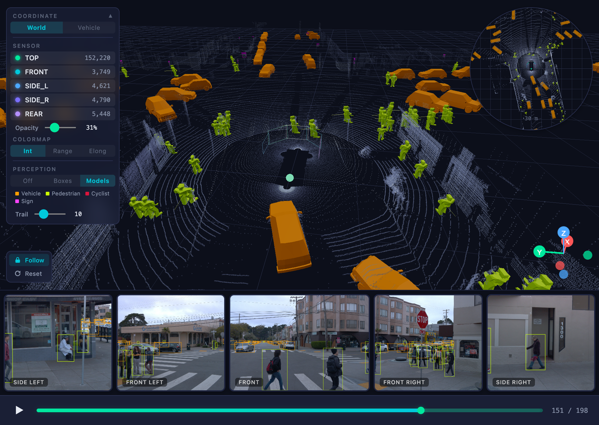

<p align="center">
  
</p>

<p align="center">
  Browser-native 3D perception explorer for Waymo Open Dataset v2.0 Perception<br/>
  No install. No server. Your data never leaves your browser.
</p>

<p align="center">
  
</p>

## Highlights

- **See what the car sees** — explore real self-driving scenes in 3D with LiDAR point clouds and 5 synchronized camera views
- **3D object models** — vehicles, pedestrians, and cyclists rendered as 3D models with color-coded tracking
- **Camera POV mode** — click a camera to jump into its viewpoint in 3D, compare what the sensor sees side by side
- **Cross-modal linking** — hover over a camera detection and its 3D counterpart lights up, and vice versa

**Already have Waymo Open Dataset v2.0 Perception downloaded?** Just open the [live demo](https://heejaekim.github.io/waymo-perception-studio), drop your files, and go.

## Get Started

You need [Waymo Open Dataset v2.0 Perception](https://waymo.com/open/) Parquet files (free with a Google account).

<details>
<summary><strong>Download script</strong></summary>

```bash
# Install Google Cloud CLI: https://cloud.google.com/sdk/docs/install
gcloud auth login

BUCKET="gs://waymo_open_dataset_v_2_0_1/training"
COMPONENTS="vehicle_pose lidar_calibration camera_calibration lidar_box lidar lidar_camera_projection camera_image"
N=1  # Number of segments to download (~500 MB each)

SEGMENTS=$(gsutil ls "$BUCKET/vehicle_pose/*.parquet" | head -$N | xargs -I{} basename {} .parquet)

for SEG in $SEGMENTS; do
  echo "Downloading $SEG"
  for C in $COMPONENTS; do
    mkdir -p waymo_data/$C
    gsutil -m cp "$BUCKET/$C/$SEG.parquet" "waymo_data/$C/"
  done
done
```

</details>

Then drag & drop the `waymo_data/` folder into the app.

## Dev Setup

```bash
git clone https://github.com/heejaekim/waymo-perception-studio.git
cd waymo-perception-studio
npm install
npm run dev
```

## Built With

React 19 · TypeScript · Three.js · R3F · Vite · Zustand · hyparquet · Web Workers

## Browser Support

Chrome / Edge recommended (folder drag & drop + folder picker). Firefox / Safari support folder drag & drop only.

## License

MIT
